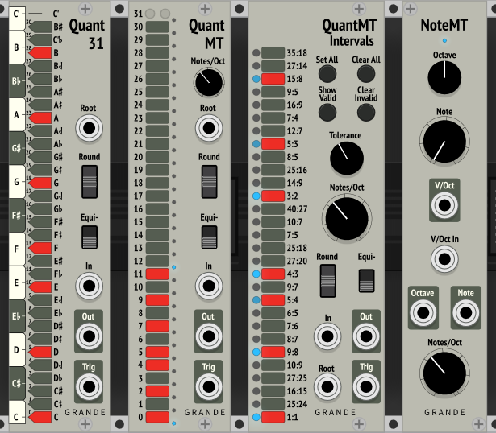

Grande Modules for VCV Rack 1.0
===============================
%%%%%%%%%%%%%%%%%%%%%%%%%%%

***Getting closer, but they're still not ready for the Library or News-of-the-Rack.***

Several former modules have been removed. This includes **CVInts**, **CVBigInts**, and **Frequency**, along with several preliminary microtonal quantizers.

I'm currently reviewing the rest, along with undertaking massive changes to **QuantIntervals**, which has doubled in size.

%%%%%%%%%%%%%%%%%%%%%%%%%%%

By David Grande

~Microtonal Collection~
=======================

Quant31
-------

A 31-TET microtonal quantizer with Equi-likely mode.

- The two small unmarked buttons at the top of the note selection column are "Set All" and "Clear All".

- Same features as **Quant** (see below), except no external scale input, and 31 buttons.

QuantMT
-------

A 1-TET through 31-TET microtonal quantizer, where the valid notes are defined directly.

- Notes/Oct knob defines temperament, from 1 to 31 (default 12).

- The note buttons between the two blue lights select valid notes. Notes outside this range are ignored.

- The two small unmarked buttons at the top of the note selection column are "Set All" and "Clear All".

- Quantizer features are the same as **Quant** (see below), minus the external scale input. 

QuantIntervals
--------------

A 1-TET through 31-TET microtonal quantizer, where the valid notes are defined indirectly by pitch intervals.

- The interval buttons select desired pitch intervals, which now include all 11-Limit intervals up to 35.

- However, these intervals need to be mapped to notes in the selected temperament. Valid notes are those that match selected intervals within the specified tolerance. These are indicated by a blue light, with the brightness indicating how close the match is.

- Only the closest intervals are generally highlighted. With so many intervals, it's common for more than one to be within tolerance of a valid note.

**Note on sizes:**

With so many different intervals, I needed to provide ways to select and filter out subsets of ratios.

- **small** = small ratios, with denominators ≤ 10, or 16:15 (C#), which is the only 12-TET chromatic note that wouldn't qualify as small.
- **large** = ratios with 30+, or with denominators ≥ 25.
- **medium** = all the rest in the middle.

**Controls:**

- **Notes/Oct** — knob that defines temperament, from 1 to 31 (default 12).

- **Tolerance** — knob that defines required accuracy for matching, from 0 to 50 cents (default 20 cents).

- **Set Small** — Enables just the **small** intervals.

- **Set All** — Enables **all** intervals.

- **Clear All** — Disables all intervals, except 1/1 unison.

- **Show Small** — Uses the lights to show all closest **small** intervals within tolerance of a valid note.

- **Show Valid** — Uses the lights to show **all** closest intervals within tolerance of a valid note.

- **Clear Invalid** — Deselects all intervals that don't have a light showing.

- **Remove Large** — Deselects all **large** intervals.

- **Remove Medium** — Deselects all **medium** (and **large**) intervals.

- **Add 11s/7s/5s/3s** — Enables all intervals with the specified factor (in the numerator or denominator).

- **Just** — Gives an approximation to Just temperament (independent of Notes/Oct). Current worst case error is one cent.

- **Show Notes** — Displays actual notes being used on left column of blue lights (root note at bottom). Useful for understanding what this quantizer is doing, and allows converting its results to another quantizer, like **QuantMT.** However, this feature is disabled when using Just temperament.

**Quantizer features:** are the same as **Quant** (see below), minus the external scale input. 

NoteMT
------

An equal temperament microtonal note generator and display preprocessor.

- Notes/Oct knob defines temperament, from 1-TET through 31-TET (default 12-TET).

- Octave and Note knobs set voltage of V/Oct output based current temperament, with Note knob clamped to Notes/Oct – 1.

- Octave and Note outputs convert V/Oct-In voltage (or knobs if input unconnected) into a pair of integer voltages. These can be displayed on a voltmeter, like the one from ML Modules.

- A blue light at the top turns on when the Note output values are integers, indicating that the Notes/Oct setting is likely matching the V/Oct-In source. However, this is not guaranteed.

~The Others~
============

Blank1HP
--------

Blank panel.

Quant
-----

12-TET Quantizer with Equi-likely mode.

- Scale (input): Use **Scale** modules and polyphonic switch to allow selecting different scales.

- Root (input): Defines root note of scale (1V/Oct, polyphonic), quantized.

- Rounding mode (switch): –1 (down) = round down, 0 (center) = round nearest, 1 (up) = round up

- Equi-likely mode (switch): 0 (down) = off, 1 (up) = on

- In (input): CV input (1V/Oct, polyphonic)

- Out (output): Quantized CV output (1V/Oct, polyphonic)

- Trigger (output): Trigger whenever note changes (polyphonic)

- Twelve buttons: Set current scale, or display externally defined scale. Root on bottom. Defaults to major scale. If no notes are selected, defaults to just the root note.

**Blues Scale using Normal quantization and rounding down:**

The probability of randomly getting each note (x-axis) depends on the interval between notes. Closely spaced notes are much less likely than farther spaced notes.

The Blues Scale is particularly obvious with its intervals of 321132, where the probability of picking individual notes varies from 8% to 25%.

**Blues Scale using Equi-likely quantization and rounding down:**

For comparison, here is the Blues Scale using Equi-likely mode.

**Note:** This equi-likely mode is best for random input frequencies. It may cause unexpected note shifting for inputs that are already more-or-less quantized.

Scale
-----

Provides extra scales for **Quant** quantizer.

- Use a polyphonic switch and plug into Scale input of **Quant.**
- Sends 12 control signals using polyphonic cable (0V or 10V).

SampleDelays (SD)
-----------------

Provides three sample-delay buffer chains giving one or two sample delays each.

- Internally chained together to give up to six sample delays.

License
-------

GPL-3.0+