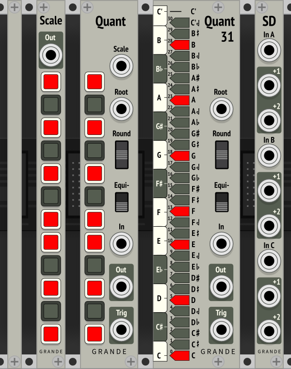
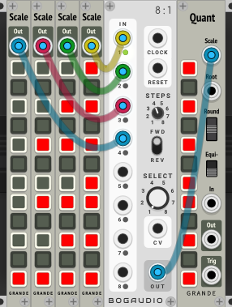
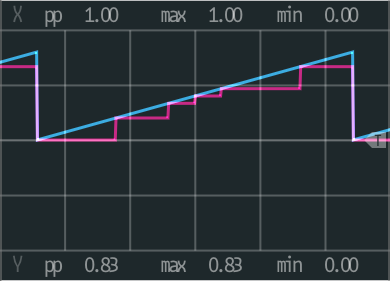
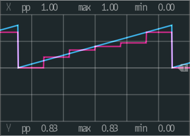

Grande Plugins for VCV Rack 1.0
===============================

By David Grande

Blank1HP
--------

Blank panel.

Scale
-----

Provides extra scales for Quant quantizer.

- **New:** Root note can now also be disabled.
- Use a polyphonic switch and plug into Scale input of Quant.
- Sends 12 control signals using polyphonic cable.

Quant
-----

12-TET Quantizer with Equi-likely mode.

- **New:** Root note can now also be disable. If no notes are selected, it defaults to just the root note.
- Scale (input): Use Scale plugins and polyphonic switch to allow selecting different scales.
- Root (input): Defines root note of scale (1V/Oct, polyphonic)
- Rounding mode (switch): –1 (down) = round down, 0 (center) = round nearest, 1 (up) = round up
- Equi-likely mode (switch): 0 (down) = off, 1 (up) = on
- In (input): CV input (1V/Oct, polyphonic)
- Out (output): Quantized CV output (1V/Oct, polyphonic)
- Trigger (output): Trigger whenever note changes (polyphonic)
- Twelve buttons: Set current scale, or display externally defined scale. Root on bottom. Defaults to major scale.

**Blues Scale using Normal quantization and rounding down:**

The probability of randomly getting each note (x-axis) depends on the interval between notes. Closely spaced notes are much less likely than farther spaced notes.

The Blues Scale is particularly obvious with its intervals of 321132, where the probability of picking individual notes varies from 8% to 25%.

**Blues Scale using Equi-likely quantization and rounding down:**

For comparison, here is the Blues Scale using Equi-likely mode.

**Note:** This equi-likely mode is best for random input frequencies. It may cause unexpected note shifting for inputs that are already more-or-less quantized.

Quant31
-------

31-TET Quantizer with Equi-likely mode.

- Same features as Quant, except no scale input, and 31 buttons.

SampleDelays (SD)
-----------------

Provides three sample-delay buffer chains giving one or two sample delays each.

- Internally chained together to give up to six sample delays.

CVInts (cvInt)
-----------

Provides 3 pairs of integer CVs from 0V to 10V (both + and –).

CVBigInts (cvBI)
-------------

Provides 3 pairs of integer CVs from 0V to 32V (both + and –).

***Exceeds normal voltage standards, so use with caution.***

**New:** Added red underline to distinguish this plugin from CVInt.

License
-------

GPL-3.0+